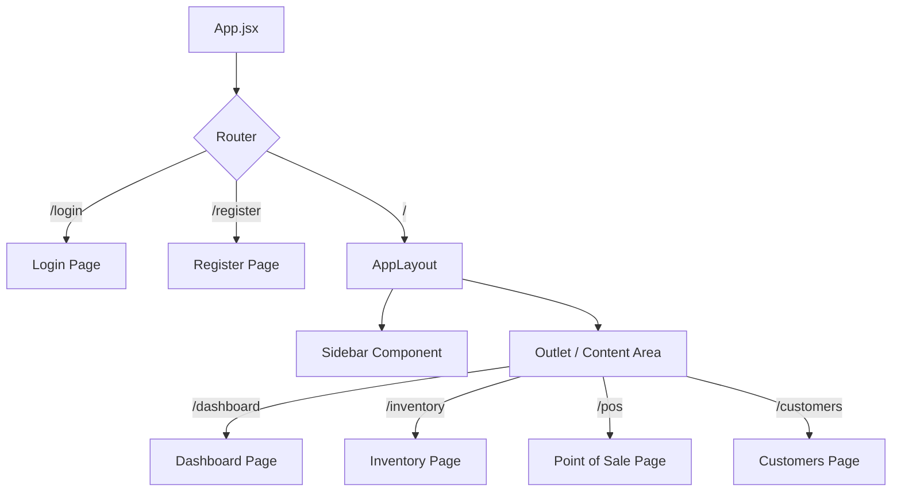
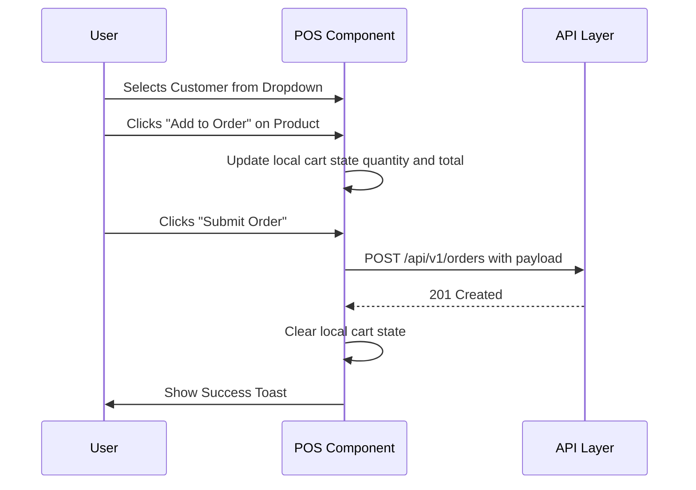

# Frontend Architecture

This document explains how the React UI is structured, how I handle client-side routing, and how I manage application state.

## Component Hierarchy & Routing

I use `react-router-dom` v7 to manage client-side routing. The application uses a nested layout structure to avoid re-rendering the sidebar and navigation bar when switching between dashboard pages.

### Protected Routes
In standard enterprise applications, anonymous users should not be able to access the dashboard.
Because my JWT tokens are stored securely in `HttpOnly` cookies, the frontend cannot directly read them. 

Instead, the frontend relies on the HTTP response codes from the backend. If a user navigates to `/inventory` and the API call returns `401 Unauthorized`, the Axios interceptor in `api.js` immediately intercepts the response and redirects the user to `/login`.

## State Management

Instead of relying on heavy global state management libraries like Redux, I utilize a combination of React's native hooks (`useState`, `useEffect`) and modular API calls.

For global UI states (e.g., displaying error or success banners), I use `react-hot-toast`, which allows any component to trigger a notification popup without passing props deeply down the component tree.

## Point of Sale (POS) Component Design

The POS system (`src/pages/POS.jsx`) is the most complex component in the application. It acts as a mini-state machine managing the active shopping cart.

## Styling & Tailwind CSS

I utilize standard, utility-first CSS via Tailwind. 
*   **Why Tailwind?** It prevents the CSS bundle from growing linearly as the application grows, ensuring blazing fast load times on the Vercel edge network.
*   I rely on standard, readable Tailwind colors (e.g., Slate, Emerald, Rose) to create a clean, modern aesthetic without resorting to overly trendy/distracting gradients.
